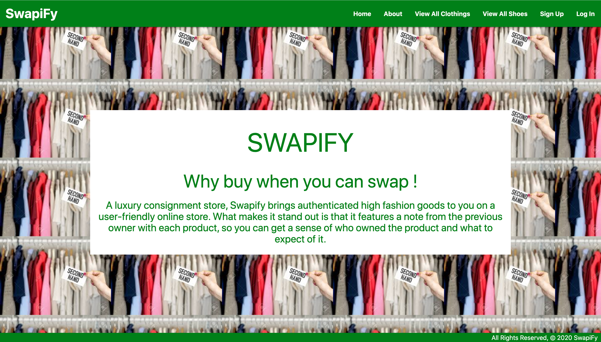

# Swapify

## A luxury consignment store, Swapify brings authenticated high fashion goods to you on a user-friendly online store. What makes it stand out is that it features a note from the previous owner with each product, so you can get a sense of who owned the product and what to expect of it.

# [Lets Swap(ify)](https://teamswapify.herokuapp.com/)

# Planning:

## Trello Board:

### We defined the workflow of the whole project from ideation to production deployment. We divided them into different boards and ticked them off as we implemented each feature.

## Draw.io ERD:

### One to one , one to many and many to many relationships between the models were defined.

## Home page:

## About

## Clothing Index

## Shoe Index

## Clothing Details

## Shoe Details

## Add Clothing

## Add Shoes

# Getting Started

### Swapify is a fullstack Django app performing CRUD operations and applies one to many and many to many relationship models utilizing Django’s built-in ORM.

## Installation

### First, install the packages required to run the application:

## Homebrew (Mac Only)

### Homebrew is a package manager that installs various command line tools easily.

### Open up terminal, and paste the following command to install Homebrew. You might be prompted to install XCode Command Line Tools during the installation process.

### If you are prompted to install the XCode CLI, say yes and your homebrew installation will continue.

### After the installation process, run the command brew doctor. If any warnings or errors are displayed, we will need to resolve them before proceeding with the rest of the install fest.

### Lastly, make sure to run brew update to make sure you have the latest lists of available software.

## Python 3

### For Mac: Install Python using Homebrew with this command: 

- ### brew install python3
- ### pip3 install psycopg2-binary
- ### You can test the installation by running python3 --version.
- ### Python 3's package manager, pip3 should have automatically been installed with Python 3. Test that it was installed by running pip3 --version.

## Django

### Use pip3 to install Django, a robust web framework for Python. Install the latest version (3.x.x):

- ### \$pip3 install Django
- ### If this command fails try -python3 -m pip install Django

## PostgreSQL

## For Mac:

### Install the PostgreSQL database management system (DBMS) using Homebrew with this command:

- ### brew install postgresql
- ### After Postgres is installed run this command:
  ### brew services start postgresql
- ### Followed by this command to test the install by creating a new database named the same as the current system user:
  ### createdb (your database name)

#### Lastly, clone this repository and install dependencies:

- ### git clone ourlink.git

# Tools Used:

### The following tools have been used for this project.

- ### Trello (for creating user story boards)
- ### Draw.io (for creating ERD)
- ### Python (3.5.1 or newer)
- ### Django(3.5.5 or newer)
- ### Postgresql(12.0 or newer)
- ### CSS3(Materialize Framework)
- ### HTML5
- ### AWS S3(for uploading images)
- ### Heroku (for Web app deployment)

# Process Overview:

## Django:

## Authentication

- ### Django’s built-in authentication was used and User Model was imported
- ### A superuser was created in the shell.
- ### MVT architecture has been heavily used(followed) to create this app.

## Model

- ### A model has a one-to-one mapping with a table in the database .Models have been used to perform CRUD data operations on the database.
- ### Main models for swapify include Clothing, Shoes. Dunder methods have been defined in models.py as well.

## URLs

### When a user makes a request for a page on a web app, Django controller takes over to look for the corresponding view via the url.py file, and then return the HTML response or a 404 not found error, if not found.

## Views

### A view function, or view for short, is a Python3 function that takes a Web request and returns a Web response(returns an HTML page).

## CBV

### Class-based views have been used extensively to work with the models.

- ### ListView - to implement the "index" (list) functionality for a particular Model.
- ### DetailView - used to implement the "detail" page for an instance of a Model
- ### CreateView - used to create an instance of a Model
- ### DeleteView - used to delete an instance of a Model
- ### UpdateView - used to update an instance of a Model

## Template

### In each step, appropriate templates have been created to render views.

## Pushing the production version

- ### Install gunicorn
- ### The built-in development server that has been running with python3 manage.py runserver is not suitable for deployment.
- ### gunicorn is a Python HTTP Server designed to work with Linux/Unix servers such as Heroku's.
- ### Install it:
  ### \$ pip3 install gunicorn
- ### If run into error, enter the following prompt:
- ### pip3 install psycopg2

# Planned future upgrades:

- ### Add and display username, add and follow other sellers
- ### Add Reviews and rate items
- ### Add more categories to swap such as books, electronics and furniture.
- ### Implement a token-based swap system. Users would be able to use tokens to swap items, give away tokens for a promotion, save tokens to purchase a bigger item.

# Team:

- ### Alina Wang
- ### Clara Lan
- ### Eva Cubas Vasquez
- ### Raihan Morshed
- ### Rashmika

# Acknowledgements/Troubleshooting:

- ### Jeremy Tupper
- ### Aidan Bell
